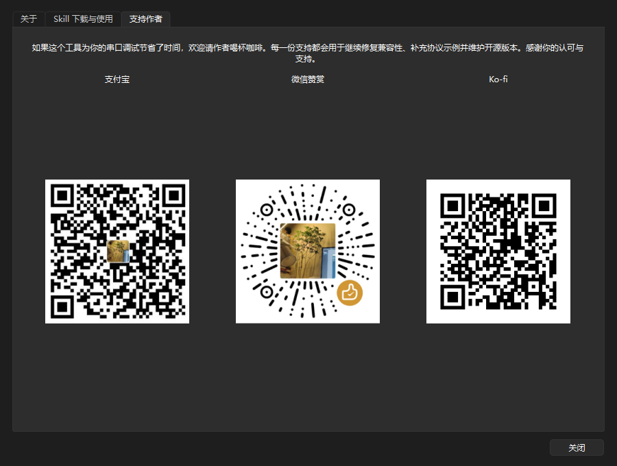

<p align="center">
  
</p>

<h1 align="center">Serial Protocol Tester / 串口协议测试器</h1>

<p align="center">PySide6 上位机、下位机与虚拟串口调试工具<br>PySide6 host, device, and virtual serial-port testing console</p>

<p align="center">
  <a href="https://github.com/10walnut/serial-protocol-tester-app/stargazers"></a>
  <a href="https://github.com/10walnut/serial-protocol-tester-app/releases"></a>
  <a href="https://github.com/10walnut/serial-protocol-tester-app/releases/latest"></a>
  <a href="https://github.com/10walnut/serial-protocol-tester-app/actions/workflows/build-windows.yml"></a>
  <a href="LICENSE"></a>
</p>

<p align="center">
  <a href="https://ko-fi.com/B7J7268GW1"></a>
</p>

<p align="center">
  <a href="#中文">中文</a> · <a href="#english">English</a> ·
  <a href="https://github.com/10walnut/serial-protocol-tester-skill">协议转换 Skill</a> ·
  <a href="https://github.com/10walnut/serial-protocol-tester-app/releases/latest">下载最新版</a>
</p>


## 中文

Serial Protocol Tester 读取标准 `serial_protocol.v1` JSON，把协议文档里的命令、应答、变量公式和周期数据变成可直接操作的按钮。它既能连接真实下位机，也能模拟下位机供其他上位机测试。

### 一分钟开始

1. 从 [Releases](https://github.com/10walnut/serial-protocol-tester-app/releases/latest) 下载 `SerialProtocolTester.exe`。
2. 运行软件并允许管理员权限；该权限用于创建和检查 Windows 虚拟串口。
3. 点击“加载协议”，选择 Skill 生成的 JSON 或自带的 `app/sample_protocol.json`。
4. 选择角色、通信通道和串口参数，点击“打开”，再双击命令开始测试。

> 没有协议 JSON？使用配套的 [Serial Protocol Tester Skill](https://github.com/10walnut/serial-protocol-tester-skill) 读取 Word、Markdown、PDF、Excel、命令表或抓包并生成。

### 选择测试方式

| 目标 | 本软件角色 | 通信通道 | 对端 |
| --- | --- | --- | --- |
| 调试真实下位机 | 上位机 | 串口或 URL | 真实设备 |
| 测试自己开发的上位机 | 下位机 | COM10 等虚拟串口 | 上位机打开 COM11 |
| 单机验证协议按钮和应答 | 上位机 | 内部虚拟链路 | 软件内部模拟器 |
| 编写设备模拟程序 | 上位机 | `loop://` 或虚拟串口 | 测试程序 |

### 上位机连接真实设备

1. 用 USB 转串口连接设备并确认 Windows 中的 COM 号。
2. 选择“上位机”和“串口或 URL”，选择 COM 端口。
3. 波特率会从协议预加载，也可直接输入 50-4000000 范围内的值。
4. 打开连接后发送命令；TX、RX、原始 HEX 和命令名称会进入右侧记录。
5. 周期数据保持“跟随最新”即可自动显示最后一行；字段计算较多时点击“刷新解析”。
6. 取消“跟随最新”后可稳定查看历史帧，点击历史行即可重新解析该帧。

软件支持帧头、长度字段、分包、粘包、校验和、大小端、有符号值、比例换算和枚举。高频数据由接收队列分批处理，通讯记录保留最近 2000 条。

### 下位机模拟与多段回复

在“下位机”角色下，外部上位机发送的完整请求会匹配 `commands[].request`。软件先发送 `response`，随后执行 `follow_up_replies`；停止命令通过 `stop_streams` 取消周期数据。

```json
{
  "response": {"encoding": "hex", "data": "AA 55 81 01 00"},
  "follow_up_replies": [
    {
      "frame_ref": "realtime_data",
      "delay_ms": 100,
      "interval_ms": 100,
      "repeat_count": 0,
      "stream_id": "realtime",
      "prompt_variables": true
    }
  ],
  "auto_reply": true
}
```

`prompt_variables: true` 会先询问传感器或设定值，再按 JSON 中的公式组帧。`repeat_count: 0` 表示持续发送，直到命令的 `stop_streams` 包含相同 `stream_id`。

### 创建 COM10 ↔ COM11

Windows 用户态软件不能独立创建 COM 设备，本功能调用已安装的 com0com 驱动。推荐下载官方 [com0com 3.0.0.0 已签名版本](https://sourceforge.net/projects/com0com/files/com0com/3.0.0.0/com0com-3.0.0.0-i386-and-x64-signed.zip/download)。

1. 安装驱动并重启 Windows，在设备管理器确认没有黄色警告。
2. 软件中点击“虚拟串口”，确认 `setupc.exe` 路径。
3. 设置本软件端口 COM10、外部软件端口 COM11，点击“创建端口对”。
4. 只有两个端口都出现在“端口（COM 和 LPT）”且能被 pyserial 枚举时，软件才提示成功。
5. 本软件选择“下位机 + COM10”，待测试上位机选择 COM11；两端串口参数必须一致。

如果端口只出现在 `com0com - serial port emulators` 分类中，请删除旧端口对后重新创建。部分启用 Secure Boot 的 Windows 10/11 系统仍可能拒绝旧版驱动并显示代码 52；软件不会关闭系统签名验证。

### 从源码运行

```powershell
git clone https://github.com/10walnut/serial-protocol-tester-app.git
cd serial-protocol-tester-app
.\start_serial_console.ps1
```

也可双击 `start_serial_console.bat`。首次运行会创建 `app/.venv` 并安装依赖。环境检查与打包：

```powershell
.\start_serial_console.ps1 -CheckOnly
python -m unittest discover -s tests -p "test_*.py" -v
.\build_serial_console.ps1
```

打包脚本会生成多尺寸 Windows 图标、隔离 Qt DLL、嵌入管理员清单，并运行打包后的 `--self-test`。输出位于 `dist/SerialProtocolTester.exe`。

### 赞赏

如果这个工具节省了串口调试时间，可以通过 Ko-fi、支付宝或微信支持后续维护。感谢每一位使用者、反馈者和贡献者。

<p align="center">
  <a href="https://ko-fi.com/B7J7268GW1"></a>
</p>

<table align="center">
  <tr><th>支付宝</th><th>微信赞赏</th><th>Ko-fi</th></tr>
  <tr>
    <td></td>
    <td></td>
    <td></td>
  </tr>
</table>

软件内也可通过“关于 → 支持作者”查看三个二维码：



## English

Serial Protocol Tester executes validated `serial_protocol.v1` files as an interactive PySide6 host/device simulator. It connects to physical devices, emulates a device for another host application, schedules multiple replies, rebuilds variable frames, and explains TX/RX bytes.

### Quick Start

1. Download `SerialProtocolTester.exe` from the [latest release](https://github.com/10walnut/serial-protocol-tester-app/releases/latest).
2. Run it and approve administrator access, which is used for virtual-port creation and diagnostics.
3. Load a JSON file generated by the companion [Serial Protocol Tester Skill](https://github.com/10walnut/serial-protocol-tester-skill), or use `app/sample_protocol.json`.
4. Select a role and transport, open the connection, then double-click a command.

### Test Workflows

| Goal | App role | Transport | Peer |
| --- | --- | --- | --- |
| Test a physical device | Host | COM port or URL | Real device |
| Test your host application | Device | Virtual COM10 | Host app on COM11 |
| Validate JSON without hardware | Host | Internal virtual link | Built-in simulator |

For a physical device, select **Host**, choose the COM port, verify baud/data/parity/stop settings, and send a command. Keep **Follow latest** enabled for live traffic. Repeated frames avoid automatic field calculations; select **Refresh details** when you need the latest byte-level explanation. Disable follow mode to inspect older frames.

In **Device** mode, a matched request sends `response` first and then runs `follow_up_replies`. An `interval_ms: 100` reply repeats every 100 ms, while a later command can cancel its `stream_id` through `stop_streams`.

For two-application testing, install the official [signed com0com package](https://sourceforge.net/projects/com0com/files/com0com/3.0.0.0/com0com-3.0.0.0-i386-and-x64-signed.zip/download), create COM10 ↔ COM11 in **Virtual ports**, open one side here, and open the other side in your host application. Both ports must appear under Windows **Ports (COM & LPT)**.

### Source and Packaging

```powershell
git clone https://github.com/10walnut/serial-protocol-tester-app.git
cd serial-protocol-tester-app
.\start_serial_console.ps1
python -m unittest discover -s tests -p "test_*.py" -v
.\build_serial_console.ps1
```

The build script creates `dist/SerialProtocolTester.exe`, embeds the multi-resolution icon and administrator manifest, isolates Qt dependencies, and runs a packaged self-test.

### Support

Support ongoing compatibility work, protocol examples, and public releases through [Ko-fi](https://ko-fi.com/B7J7268GW1), Alipay, or WeChat. The three QR codes are shown in the Chinese section and inside **About → Support**.

### Credits

Virtual COM support uses [com0com](https://sourceforge.net/projects/com0com/). Thanks to Vyacheslav Frolov and all contributors for the GPL Windows null-modem driver. This repository links to the official package and does not redistribute the driver. Application code is MIT licensed and maintained by `十个核桃 / 10walnut`.
