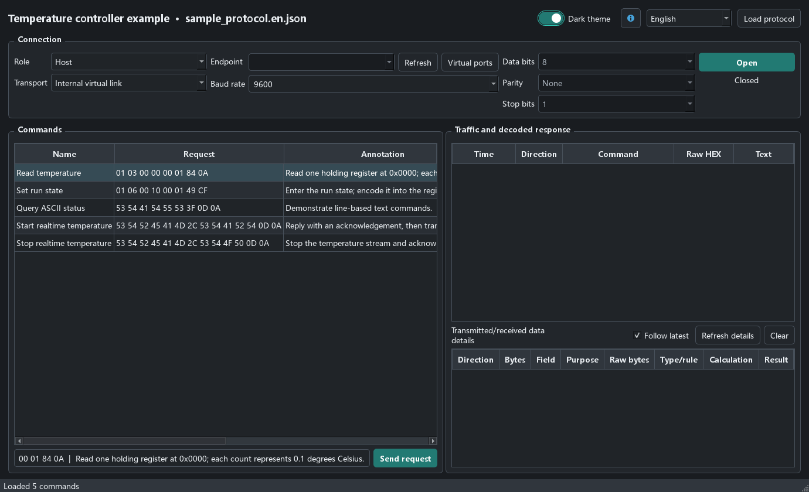

# Serial Protocol Assistant: Installation and Testing Guide

For version 1.4.1. [中文图解](README.md) · [Offline illustrated guide](index.html)

[English EXE](https://github.com/10walnut/serial-protocol-tester-app/releases/latest/download/SerialProtocolAssistant-EN.exe) · [Chinese EXE](https://github.com/10walnut/serial-protocol-tester-app/releases/latest/download/SerialProtocolAssistant-ZH-CN.exe)

## Download and Start

Download the EXE for your preferred language from the latest release. The English edition starts with an English interface and example protocol; the Chinese edition starts in Chinese. Both support all available interface languages. Each edition remembers manual language selection. Your own JSON annotations are not automatically translated.

Keep the EXE in a convenient folder, run it, and approve the administrator prompt. You do not need a separate Python or PySide6 installation. The application starts with five example commands. Dark mode is on by default and can be changed using the top-bar switch.



The top row loads a protocol and controls appearance. Connection settings select the role, transport and serial parameters. Commands are on the left; traffic and the selected frame's byte explanations are on the right.

## Install the Skill and Convert Your Protocol

Download the Skill ZIP from [the Skill release page](https://github.com/10walnut/serial-protocol-tester-skill/releases/latest). In Doubao, use Create Skill → Upload Skill and upload the ZIP containing `SKILL.md`. For Claude Code, extract the ZIP and run `install.ps1 -Target claude`; use the matching installation target in the repository README for other supported clients.

Invoke `serial-protocol-assistant` in the AI client, provide the vendor specification and sample traffic, and request English-only `serial_protocol.v1` JSON. Specify editable variables, documented formulas, acknowledgement frames, repeated replies and stop conditions. Ask the agent to clarify missing rules, validate the JSON, and check known frames. Close the connection before loading a different protocol in the app.

## First Test Without Hardware

1. Keep the bundled temperature-controller example loaded.
2. Select **Host** and **Internal virtual link**, then click **Open**.
3. Double-click **Read temperature**.
4. Confirm these frames in the traffic table:

```text
TX  01 03 00 00 00 01 84 0A
RX  01 03 02 00 FA 38 07
```

The temperature bytes `00 FA` represent 250 in big-endian order. With a scale of 0.1, the result is 25.0 °C. This is simulated data. The internal link does not create a COM port for other programs.

For an editable request, open **Set run state**, select **Running**, then **Generate and Send**. The resulting frame is `01 06 00 10 00 01 49 CF`. This bundled example uses a fixed response template and does not emulate a complete device state machine or dynamically echo every input change.

## Install com0com and Create a Port Pair

You need a virtual COM driver only when connecting two separate applications. Physical serial devices and the internal simulator do not require com0com.

Download the official [signed com0com package](https://sourceforge.net/projects/com0com/files/com0com/3.0.0.0/com0com-3.0.0.0-i386-and-x64-signed.zip/download), extract it, and run the included installer. Follow its wizard and restart if requested. If it offers a pair type, use `COM# ↔ COM#`; alternatively, finish installing the driver and create the pair from this app. Actual wizard screens depend on the package and system.

1. Start Serial Protocol Assistant with administrator access and select **Virtual ports**.
2. Verify the `setupc.exe` path, typically under `C:\Program Files (x86)\com0com` or `C:\Program Files\com0com`.
3. Choose two unused COM numbers, for example COM10 and COM11, and create the pair once.
4. Refresh the status and the main port list.
5. Check that both ports appear under Device Manager's **Ports (COM & LPT)** and can be enumerated and opened by the two programs.

Finding `setupc.exe` only confirms that the configuration tool exists. It does not prove that a usable port pair was created. `PortName=COM#` selects the Windows Ports-class naming path; `RealPortName` is the assigned COM number. Open one end in each program, not the same COM port in both.

If only the com0com emulator category appears, check the Ports-class configuration and assigned COM names. A driver warning or code 52 needs driver-compatibility investigation. Error 740 means elevation is required. Do not disable Windows signature checks to follow this guide.

## Host Mode with a Physical Device

Load the actual device's protocol, select **Host** and **COM port or URL**, select its real port, verify the serial parameters, and click **Open**. Start with a known read-only query. Outgoing requests appear as TX and device replies as RX. Use the protocol's start and stop commands for realtime data.

The guide's COM3 and temperature example are illustrative. They are not the correct settings or commands for an arbitrary physical device.

## Device Mode with Another Host Application

Load the bundled example here. Select **Device**, **COM port or URL**, and COM10, using 9600 baud, 8 data bits, no parity and 1 stop bit. Open COM11 in the external host or serial terminal with matching settings.

Send `01 03 00 00 00 01 84 0A` in HEX mode with no extra newline. The terminal should receive `01 03 02 00 FA 38 07`. Here, the request is RX and the response TX; the external host sees the reverse directions.

Automatic replies require Device mode, a matching request and `auto_reply: true`. Host mode does not automatically act as a device when a request arrives.

## Acknowledgement, Stream and Stop

From the external terminal, send these HEX commands. They already contain CR LF; do not append another line ending.

```text
Start: 53 54 52 45 41 4D 2C 53 54 41 52 54 0D 0A
Stop:  53 54 52 45 41 4D 2C 53 54 4F 50 0D 0A
```

The example acknowledges with `OK,STREAM\r\n`, then transmits `TEMP,25.0\r\n` at a configured 100 ms interval. The stop command receives `OK,STOP\r\n` and cancels the stream. Frames already queued can arrive before the stop acknowledgement. Desktop scheduling is not a hard-realtime guarantee.

For a custom protocol, define the initial `response`, `follow_up_replies`, a stable `stream_id` and matching `stop_streams`.

## Inspect Traffic and History

Keep **Follow latest** enabled to follow incoming records; use **Refresh details** when you need a detailed calculation for continuous traffic. Disable follow mode and click a historical TX/RX row to inspect that frame. Scroll horizontally to see all byte, formula and result columns. The table retains the most recent 2000 entries.

Compare expected and actual bytes before drawing conclusions: incorrect TX suggests encoding or input issues; missing traffic suggests a link issue; correct RX with wrong values suggests offsets, endianness, signedness or formulas.

## Illustration Sources

Screenshots show actual application widgets. Traffic was generated with the internal simulator. Host/device COM settings are disconnected configuration examples. The installer flow and expected Device Manager layout are explicitly labelled diagrams. This guide was not produced by installing drivers or creating new COM pairs on the author's machine.

Driver references: [official files and release notes](https://sourceforge.net/projects/com0com/files/com0com/3.0.0.0/), [com0com project](https://com0com.sourceforge.net/), and the installed project's `readme.txt` documentation of Ports-class naming. Thanks to Vyacheslav Frolov and the com0com contributors. com0com is GPL-licensed; this repository links to the official driver rather than redistributing it.
