# 串口协议助手 · 从安装到联调

适用软件 v1.4.1。每张图可放大查看；[离线图解](index.html) 与本目录图片一起保存即可浏览。

[中文版下载](https://github.com/10walnut/serial-protocol-tester-app/releases/latest/download/SerialProtocolAssistant-ZH-CN.exe) · [English download](https://github.com/10walnut/serial-protocol-tester-app/releases/latest/download/SerialProtocolAssistant-EN.exe) · [English guide](README.en.md)

## 下载安装：先选对语言版本

Windows 64 位 · 独立 EXE · 内置示例协议

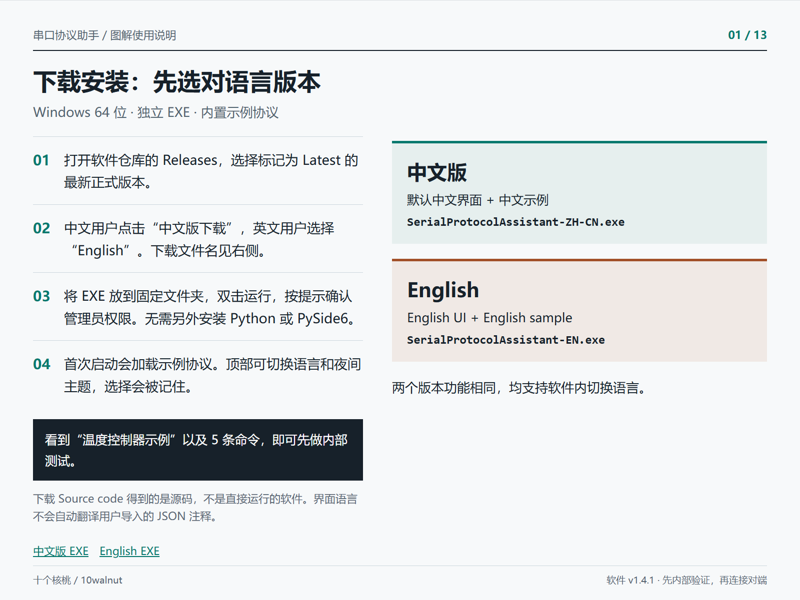

1. 打开软件仓库的 Releases，选择标记为 Latest 的最新正式版本。
2. 中文用户点击“中文版下载”，英文用户选择“English”。下载文件名见右侧。
3. 将 EXE 放到固定文件夹，双击运行，按提示确认管理员权限。无需另外安装 Python 或 PySide6。
4. 首次启动会加载示例协议。顶部可切换语言和夜间主题，选择会被记住。

**预期结果：** 看到“温度控制器示例”以及 5 条命令，即可先做内部测试。

下载 Source code 得到的是源码，不是直接运行的软件。界面语言不会自动翻译用户导入的 JSON 注释。

[中文版 EXE](https://github.com/10walnut/serial-protocol-tester-app/releases/latest/download/SerialProtocolAssistant-ZH-CN.exe) · [English EXE](https://github.com/10walnut/serial-protocol-tester-app/releases/latest/download/SerialProtocolAssistant-EN.exe)

## 认识界面：按这四个区域找功能

先加载协议，再连接；收发记录和详细解析分别查看

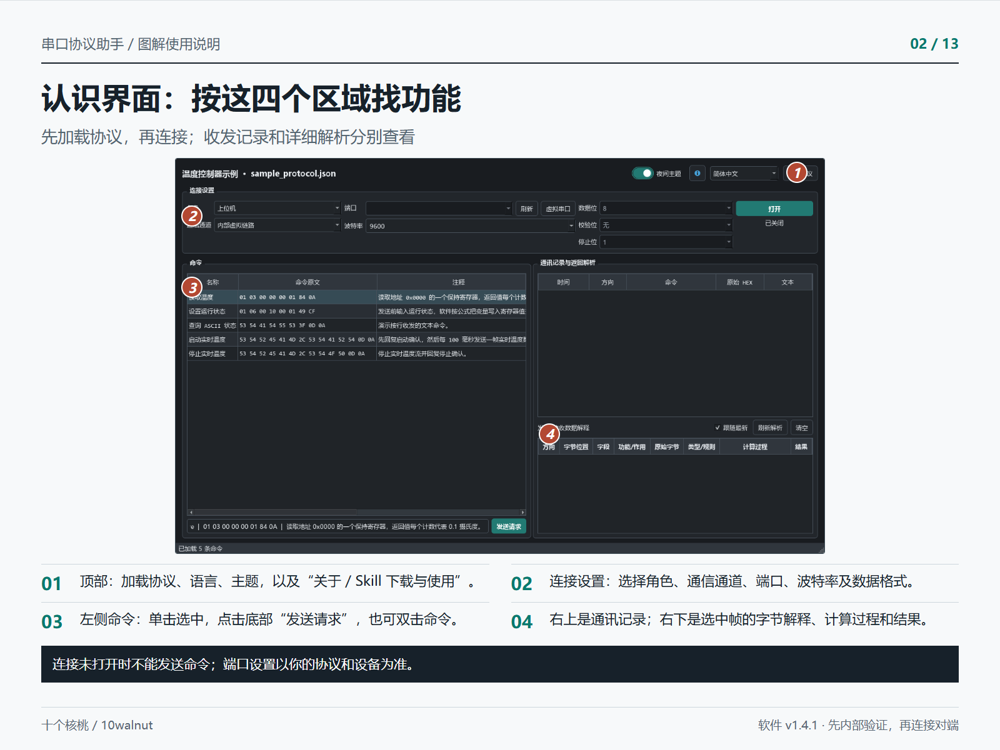

1. 顶部：加载协议、语言、主题，以及“关于 / Skill 下载与使用”。
2. 连接设置：选择角色、通信通道、端口、波特率及数据格式。
3. 左侧命令：单击选中，点击底部“发送请求”，也可双击命令。
4. 右上是通讯记录；右下是选中帧的字节解释、计算过程和结果。

**预期结果：** 连接未打开时不能发送命令；端口设置以你的协议和设备为准。

图为真实软件界面，当前尚未连接。


## 安装 Skill：把协议交给 AI 客户端

Skill 生成 JSON；串口协议助手加载 JSON 执行测试

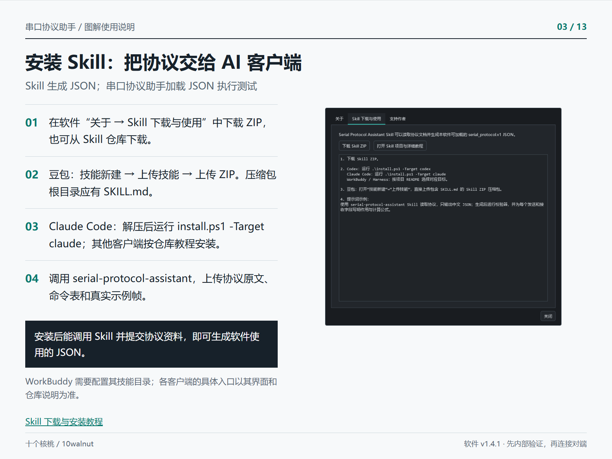

1. 在软件“关于 → Skill 下载与使用”中下载 ZIP，也可从 Skill 仓库下载。
2. 豆包：技能新建 → 上传技能 → 上传 ZIP。压缩包根目录应有 SKILL.md。
3. Claude Code：解压后运行 install.ps1 -Target claude；其他客户端按仓库教程安装。
4. 调用 serial-protocol-assistant，上传协议原文、命令表和真实示例帧。

**预期结果：** 安装后能调用 Skill 并提交协议资料，即可生成软件使用的 JSON。

WorkBuddy 需要配置其技能目录；各客户端的具体入口以其界面和仓库说明为准。

[Skill 下载与安装教程](https://github.com/10walnut/serial-protocol-tester-skill)

## 导入自己的协议：先转换，再校验

原厂文档 → 单语言 JSON → 软件“加载协议”

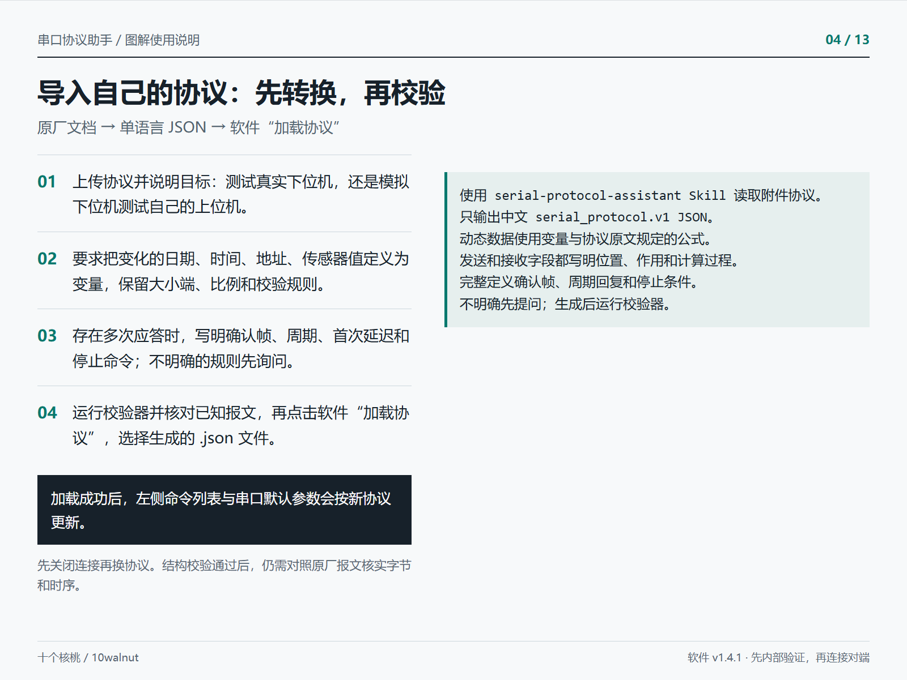

1. 上传协议并说明目标：测试真实下位机，还是模拟下位机测试自己的上位机。
2. 要求把变化的日期、时间、地址、传感器值定义为变量，保留大小端、比例和校验规则。
3. 存在多次应答时，写明确认帧、周期、首次延迟和停止命令；不明确的规则先询问。
4. 运行校验器并核对已知报文，再点击软件“加载协议”，选择生成的 .json 文件。

```text
使用 serial-protocol-assistant Skill 读取附件协议。
只输出中文 serial_protocol.v1 JSON。
动态数据使用变量与协议原文规定的公式。
发送和接收字段都写明位置、作用和计算过程。
完整定义确认帧、周期回复和停止条件。
不明确先提问；生成后运行校验器。
```

**预期结果：** 加载成功后，左侧命令列表与串口默认参数会按新协议更新。

先关闭连接再换协议。结构校验通过后，仍需对照原厂报文核实字节和时序。


## 不接硬件，先跑通第一次收发

使用内置“温度控制器示例” · 上位机 + 内部虚拟链路

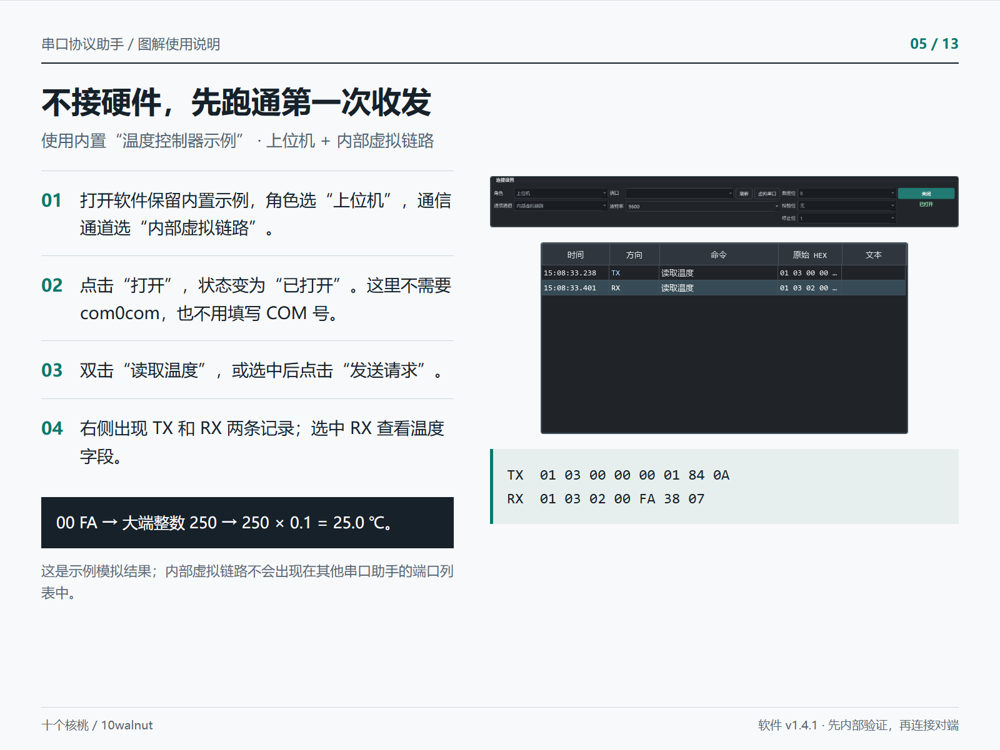

1. 打开软件保留内置示例，角色选“上位机”，通信通道选“内部虚拟链路”。
2. 点击“打开”，状态变为“已打开”。这里不需要 com0com，也不用填写 COM 号。
3. 双击“读取温度”，或选中后点击“发送请求”。
4. 右侧出现 TX 和 RX 两条记录；选中 RX 查看温度字段。

```text
TX  01 03 00 00 00 01 84 0A
RX  01 03 02 00 FA 38 07
```

**预期结果：** 00 FA → 大端整数 250 → 250 × 0.1 = 25.0 ℃。

这是示例模拟结果；内部虚拟链路不会出现在其他串口助手的端口列表中。


## 修改发送参数：让软件按公式组帧

示例操作：设置运行状态为“运行”

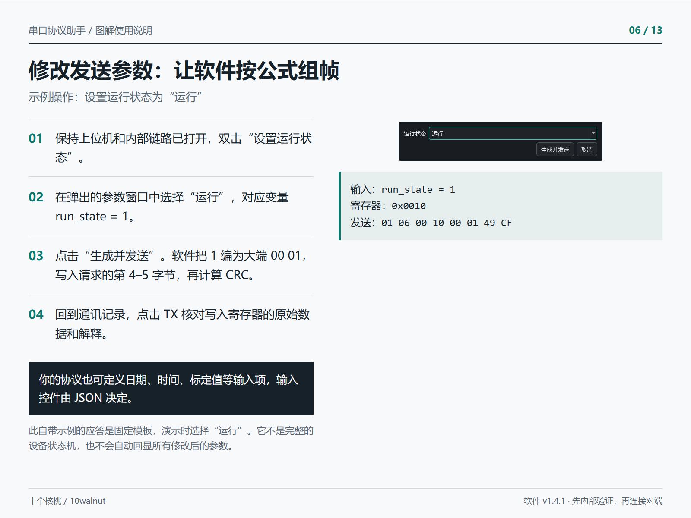

1. 保持上位机和内部链路已打开，双击“设置运行状态”。
2. 在弹出的参数窗口中选择“运行”，对应变量 run_state = 1。
3. 点击“生成并发送”。软件把 1 编为大端 00 01，写入请求的第 4–5 字节，再计算 CRC。
4. 回到通讯记录，点击 TX 核对写入寄存器的原始数据和解释。

```text
输入：run_state = 1
寄存器：0x0010
发送：01 06 00 10 00 01 49 CF
```

**预期结果：** 你的协议也可定义日期、时间、标定值等输入项，输入控件由 JSON 决定。

此自带示例的应答是固定模板，演示时选择“运行”。它不是完整的设备状态机，也不会自动回显所有修改后的参数。


## 安装 com0com：两个软件通信才需要

真实硬件连接和软件内部测试都不需要安装这个驱动

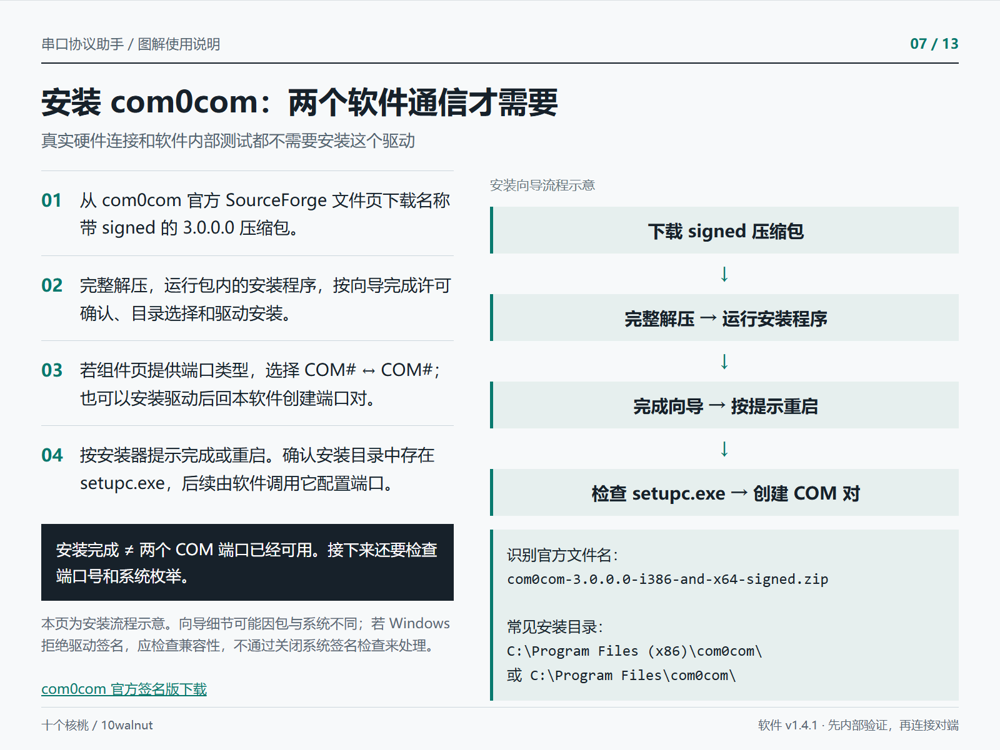

1. 从 com0com 官方 SourceForge 文件页下载名称带 signed 的 3.0.0.0 压缩包。
2. 完整解压，运行包内的安装程序，按向导完成许可确认、目录选择和驱动安装。
3. 若组件页提供端口类型，选择 COM# ↔ COM#；也可以安装驱动后回本软件创建端口对。
4. 按安装器提示完成或重启。确认安装目录中存在 setupc.exe，后续由软件调用它配置端口。

```text
识别官方文件名：
com0com-3.0.0.0-i386-and-x64-signed.zip

常见安装目录：
C:\Program Files (x86)\com0com\
或 C:\Program Files\com0com\
```

**预期结果：** 安装完成 ≠ 两个 COM 端口已经可用。接下来还要检查端口号和系统枚举。

本页为安装流程示意。向导细节可能因包与系统不同；若 Windows 拒绝驱动签名，应检查兼容性，不通过关闭系统签名检查来处理。

[com0com 官方签名版下载](https://sourceforge.net/projects/com0com/files/com0com/3.0.0.0/com0com-3.0.0.0-i386-and-x64-signed.zip/download)

## 创建 COM10 ↔ COM11 虚拟串口对

请使用当前未占用的两个 COM 号；10 和 11 只是示例

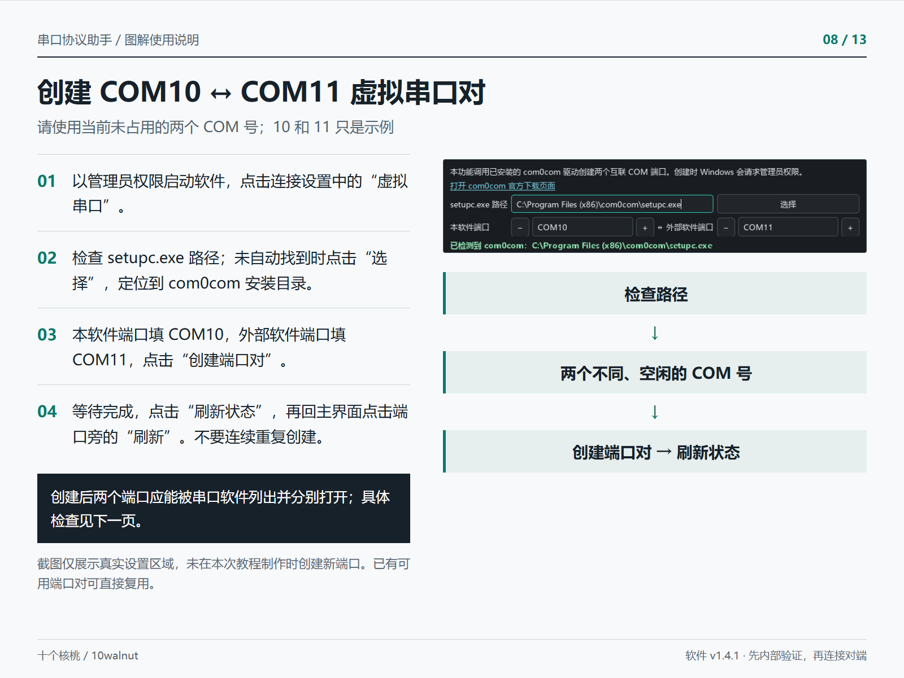

1. 以管理员权限启动软件，点击连接设置中的“虚拟串口”。
2. 检查 setupc.exe 路径；未自动找到时点击“选择”，定位到 com0com 安装目录。
3. 本软件端口填 COM10，外部软件端口填 COM11，点击“创建端口对”。
4. 等待完成，点击“刷新状态”，再回主界面点击端口旁的“刷新”。不要连续重复创建。

**预期结果：** 创建后两个端口应能被串口软件列出并分别打开；具体检查见下一页。

截图仅展示真实设置区域，未在本次教程制作时创建新端口。已有可用端口对可直接复用。


## 确认端口可用：别只看“设备增加了”

检查系统端口 → 刷新列表 → 两个软件分别打开

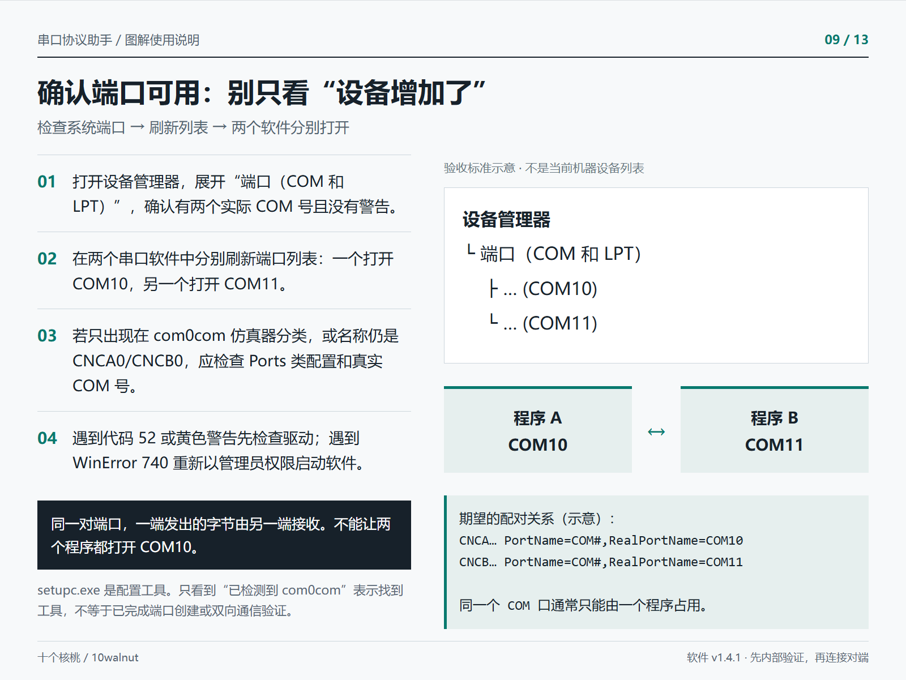

1. 打开设备管理器，展开“端口（COM 和 LPT）”，确认有两个实际 COM 号且没有警告。
2. 在两个串口软件中分别刷新端口列表：一个打开 COM10，另一个打开 COM11。
3. 若只出现在 com0com 仿真器分类，或名称仍是 CNCA0/CNCB0，应检查 Ports 类配置和真实 COM 号。
4. 遇到代码 52 或黄色警告先检查驱动；遇到 WinError 740 重新以管理员权限启动软件。

```text
期望的配对关系（示意）：
CNCA… PortName=COM#,RealPortName=COM10
CNCB… PortName=COM#,RealPortName=COM11

同一个 COM 口通常只能由一个程序占用。
```

**预期结果：** 同一对端口，一端发出的字节由另一端接收。不能让两个程序都打开 COM10。

setupc.exe 是配置工具。只看到“已检测到 com0com”表示找到工具，不等于已完成端口创建或双向通信验证。


## 上位机模式：连接真实下位机

让串口协议助手主动发送请求，由真实设备返回应答

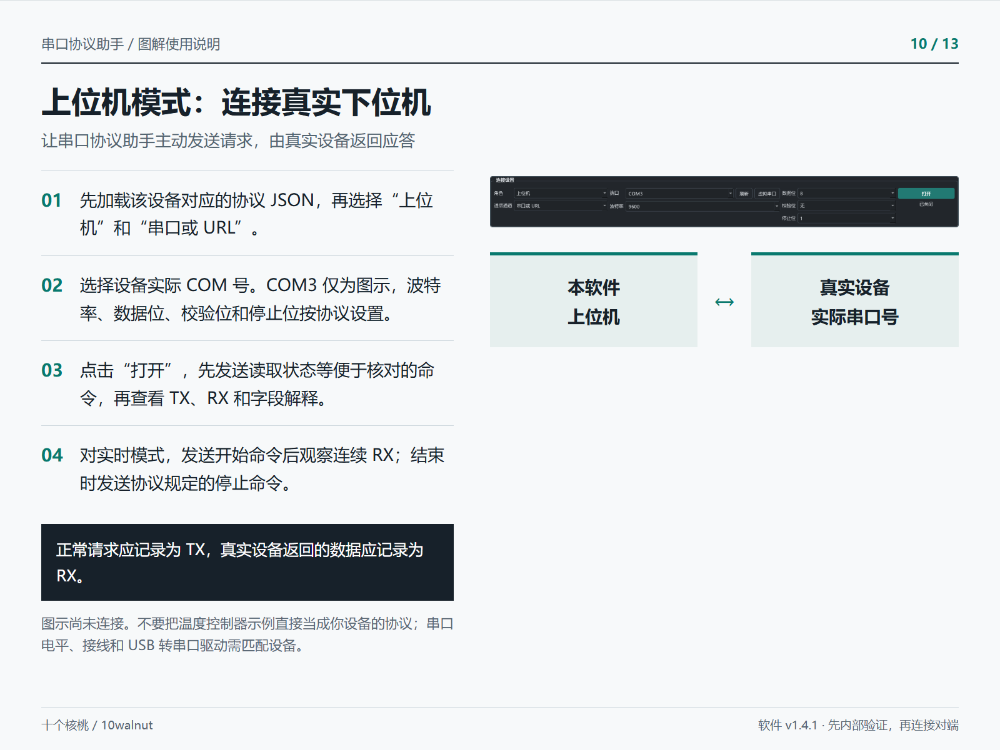

1. 先加载该设备对应的协议 JSON，再选择“上位机”和“串口或 URL”。
2. 选择设备实际 COM 号。COM3 仅为图示，波特率、数据位、校验位和停止位按协议设置。
3. 点击“打开”，先发送读取状态等便于核对的命令，再查看 TX、RX 和字段解释。
4. 对实时模式，发送开始命令后观察连续 RX；结束时发送协议规定的停止命令。

**预期结果：** 正常请求应记录为 TX，真实设备返回的数据应记录为 RX。

图示尚未连接。不要把温度控制器示例直接当成你设备的协议；串口电平、接线和 USB 转串口驱动需匹配设备。


## 下位机模式：测试你写的上位机

COM10：本软件模拟设备 ｜ COM11：你的上位机或串口助手

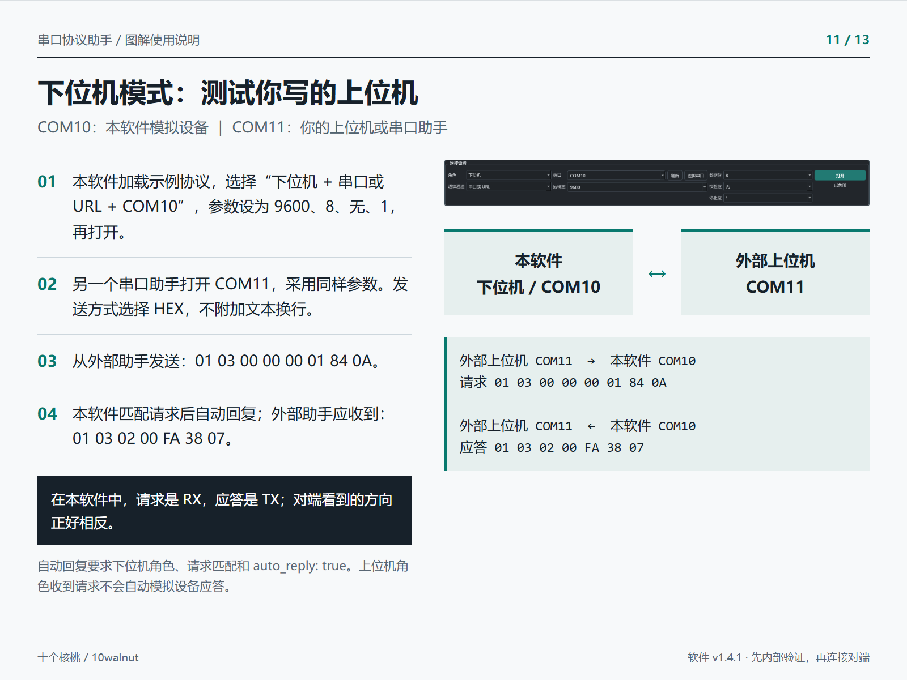

1. 本软件加载示例协议，选择“下位机 + 串口或 URL + COM10”，参数设为 9600、8、无、1，再打开。
2. 另一个串口助手打开 COM11，采用同样参数。发送方式选择 HEX，不附加文本换行。
3. 从外部助手发送：01 03 00 00 00 01 84 0A。
4. 本软件匹配请求后自动回复；外部助手应收到：01 03 02 00 FA 38 07。

```text
外部上位机 COM11  →  本软件 COM10
请求 01 03 00 00 00 01 84 0A

外部上位机 COM11  ←  本软件 COM10
应答 01 03 02 00 FA 38 07
```

**预期结果：** 在本软件中，请求是 RX，应答是 TX；对端看到的方向正好相反。

自动回复要求下位机角色、请求匹配和 auto_reply: true。上位机角色收到请求不会自动模拟设备应答。


## 验证多段回复：确认 → 实时数据 → 停止

下位机模式等待外部请求；内部链路也可先演练同一流程

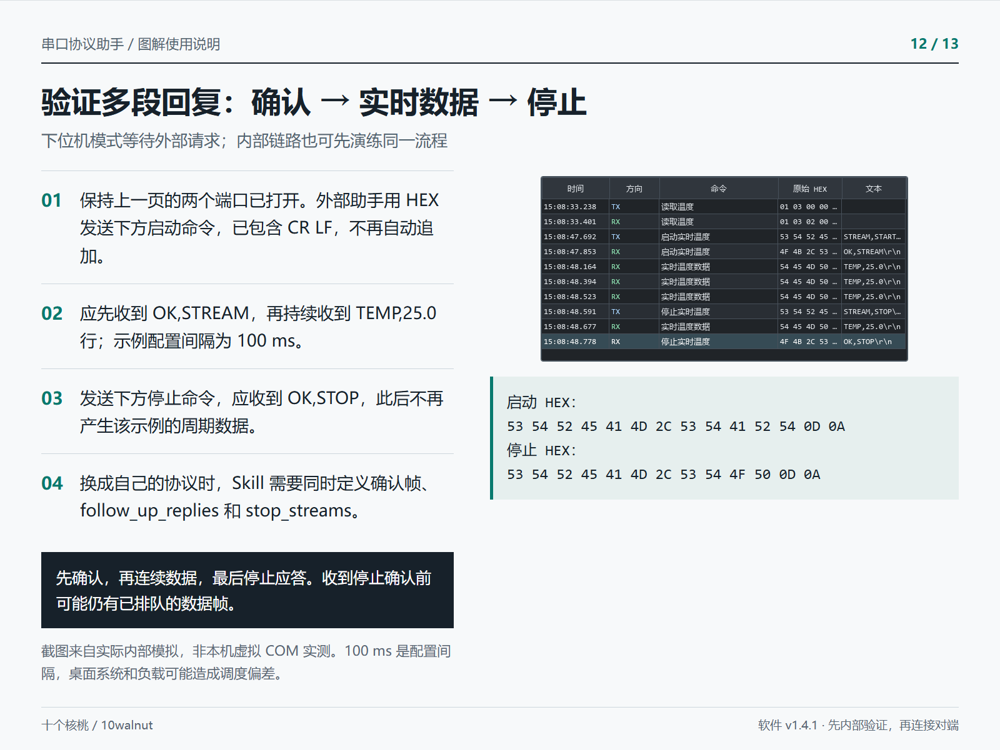

1. 保持上一页的两个端口已打开。外部助手用 HEX 发送下方启动命令，已包含 CR LF，不再自动追加。
2. 应先收到 OK,STREAM，再持续收到 TEMP,25.0 行；示例配置间隔为 100 ms。
3. 发送下方停止命令，应收到 OK,STOP，此后不再产生该示例的周期数据。
4. 换成自己的协议时，Skill 需要同时定义确认帧、follow_up_replies 和 stop_streams。

```text
启动 HEX：
53 54 52 45 41 4D 2C 53 54 41 52 54 0D 0A
停止 HEX：
53 54 52 45 41 4D 2C 53 54 4F 50 0D 0A
```

**预期结果：** 先确认，再连续数据，最后停止应答。收到停止确认前可能仍有已排队的数据帧。

截图来自实际内部模拟，非本机虚拟 COM 实测。100 ms 是配置间隔，桌面系统和负载可能造成调度偏差。


## 回看历史与解释：核对每一段数据

跟随最新看收发，选历史帧看字段；复杂计算按需刷新

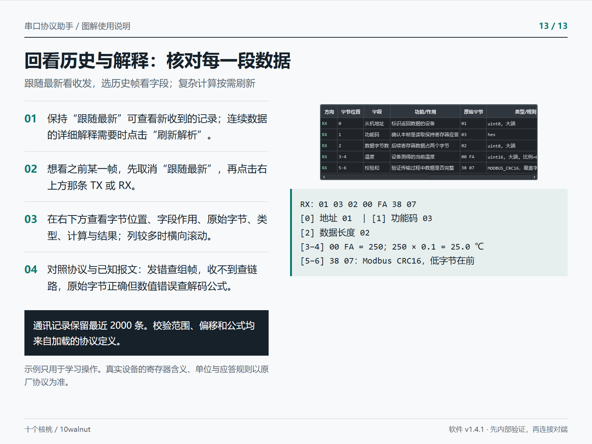

1. 保持“跟随最新”可查看新收到的记录；连续数据的详细解释需要时点击“刷新解析”。
2. 想看之前某一帧，先取消“跟随最新”，再点击右上方那条 TX 或 RX。
3. 在右下方查看字节位置、字段作用、原始字节、类型、计算与结果；列较多时横向滚动。
4. 对照协议与已知报文：发错查组帧，收不到查链路，原始字节正确但数值错误查解码公式。

```text
RX：01 03 02 00 FA 38 07
[0] 地址 01  | [1] 功能码 03
[2] 数据长度 02
[3–4] 00 FA = 250；250 × 0.1 = 25.0 ℃
[5–6] 38 07：Modbus CRC16，低字节在前
```

**预期结果：** 通讯记录保留最近 2000 条。校验范围、偏移和公式均来自加载的协议定义。

示例只用于学习操作。真实设备的寄存器含义、单位与应答规则以原厂协议为准。


## 来源与致谢

- [软件源码与说明](https://github.com/10walnut/serial-protocol-tester-app)
- [Skill 安装与协议格式](https://github.com/10walnut/serial-protocol-tester-skill)
- [com0com 官方下载及发布说明](https://sourceforge.net/projects/com0com/files/com0com/3.0.0.0/)
- [com0com 官方项目](https://com0com.sourceforge.net/)

软件截图为真实界面；报文截图使用内部模拟。安装流程和期望设备列表为示意，不代表本机已完成 com0com 创建与双向实测。感谢 Vyacheslav Frolov 及 com0com 贡献者。驱动遵循 GPL，本项目仅链接官方包。

## 配套示例文件

离线包内包含 [中文示例 JSON](examples/sample_protocol.zh.json) 和 [English sample JSON](examples/sample_protocol.en.json)。可通过“加载协议”重新载入对应示例。
